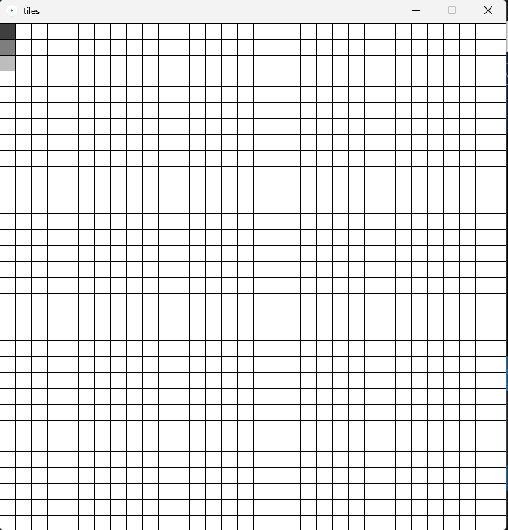
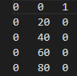

### A 32x32 Interactive Map    
This project was made to demonstrate a pixel display with a 2-D Location and a 3rd Dimension [K] in which it is represented by a gradient  

::: Controls :::  
[Left Click]  =  Changes the K Value  
[Right Click]  =  Sets all Pixels' K value back to 0  
[Space]  =  Saves the K value to the file *tiles_map.txt*  
[R]  =  Reads *tiles_map.txt* and projects the K value onto the map  
 

::: Image of the Interactive Map :::   
  

::: Text File format for the (x, y, k) coordinate system :::  
To normalize the coordinate system, divide the (x, y) axis by 20  
  
  
.  
  
::: Required Programs :::  
Processing (https://processing.org/)  
